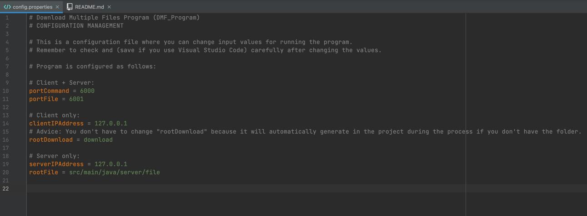
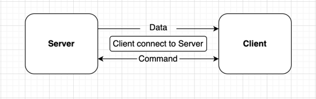
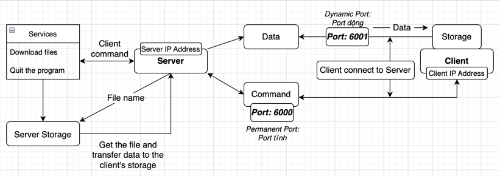
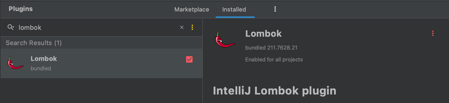
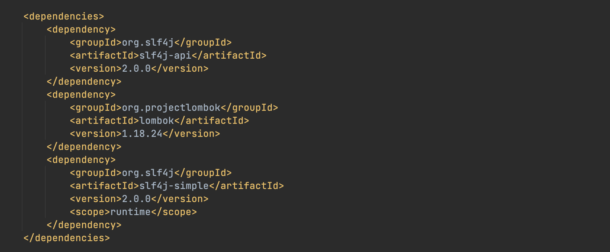
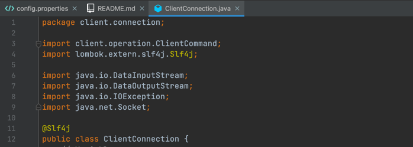

# Download Multiple Files - DMF Program

- This is a program of presenting a menu of server's services based on client's command.
- Project link (GitHub) : https://github.com/phamgiaphuc/DownloadMultipleFiles
- Project's author: Pham Gia Phuc - Acus
- Personal profile: https://github.com/phamgiaphuc
- Contact Email: acuscodinghcm@gmail.com

### Languages, tools and topics in this project:

1. Java.
2. Socket Programming and File Transfer Protocol.
3. Maven.

-----------------------------------
<ins>

### USER GUIDE

</ins>

### STEP 1:  Before running program, you make sure your computer already installed tools below:

- JDK version 18.0.2 or later.
- JFX version 18.0.2 or later.
- Maven version 4.0.0 or later.

> I recommend JDK, JFX and Maven version must be match (the same as above versions) in order to have full experience to run the program successfully.

- Check the pom.xml file if the third library "Lombok" is installed in the file 
  
> If the library is not installed, check the "Install third library guide" section.

### STEP 2: Program is configured as follows

> You can check and change the configuration in the config.properties file: [src/main/resources/configuration/config.properties](src/main/resources/configuration/config.properties)



> Please make sure the values in the configuration is correct.

**1. Server's configuration:**

- First value - **port command** (receiving client's command): 6000
- Second value - **port file** (transferring data or downloading files to client's storage): 6001
- Third value - **server IP address**: your IP address or 127.0.0.1 (localhost)
- Fourth value - **directory path for 'file' folder**: [src/main/java/server/file](src/main/java/server/file)

**2. Client's configuration:**

- First value - **port command** (sending the client's command to server): 6000
- Second value - **port file** (receiving data or downloading files from server): 6001
- Third value - **server IP address**: your IP address or 127.0.0.1 (localhost)
- Fourth value - **directory path for 'download' folder** - all the download files will be stored in here: [download](download)

### STEP 3: Run the program
Click the file path below:

> The Server need initiating first then you can run the Client or Application.

- To run **Server**, go to: [src/main/java/server/connection/ServerConfiguration.java](src/main/java/server/connection/ServerConfiguration.java)
- To run **Client**, go to: [src/main/java/client/connection/ClientConfiguration.java](src/main/java/client/connection/ClientConfiguration.java)

-----------------------------------
<ins>

### OPERATING ILLUSTRATION PICTURES

</ins>

1. Client to Server (port command): **two-way connection**.

- **Client** `send the command` to the server.
- **Server** `reply by sending a menu of services based on the command` for
  client to choose next command/action.

2. Server to Client (port file): **one-way connection**.

- **Server** bases on the command/action to `transfer only the data or downloading files` to the **client**.

#### Simple picture:



#### Detail picture:



-----------------------------------

<ins>

### INSTALLING THIRD LIBRARY GUIDE

</ins>

#### Step 1:

- Go to 'Preferences' then go to 'Plugins' and type 'lombok' to search. It will look like this




#### Step 2:

- Enable Lombok then press Apply and OK

#### Step 3:

- Go to the pom.xml file and add this code like in the picture

`code:`

```
    <dependency>
        <groupId>org.slf4j</groupId>
        <artifactId>slf4j-api</artifactId>
        <version>2.0.0</version>
    </dependency>
    <dependency>
        <groupId>org.projectlombok</groupId>
        <artifactId>lombok</artifactId>
        <version>1.18.24</version>
    </dependency>
    <dependency>
        <groupId>org.slf4j</groupId>
        <artifactId>slf4j-simple</artifactId>
        <version>2.0.0</version>
        <scope>runtime</scope>
    </dependency>
```

`picture:`



#### Step 4:

- Everytime you want to use the third library, just enter "@Slf4j" on the head of the class like this



```java
    package ftp.client;
    
    import lombok.extern.slf4j.Slf4j;
    @Slf4j 
    public class ClientConnection {
        // Variables...
    }
```

#### Step 5:

- It's done. Check the configuration again and run the program